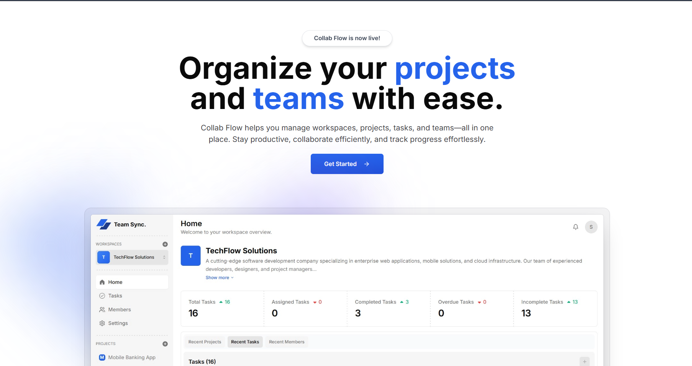

# CollabFlow
CollabFlow is a open-source workspace, project, and task management platform. Developed by Kaung Thanlwin Kyaw as a final year project for LJMU BSc Computer Network. Features multi-view tasks, real-time collaboration, and role-based access.

<br />
June, 2025. <br />

Full-stack workspace, project, and task management platform built using Next.js 14, React, TypeScript, Shadcn UI, Tailwind CSS, Hono, and Appwrite.


## Screenshots




## Author

Kaung Thanlwin Kyaw  
Final Year Project for LJMU BSc Computer Network

## Features

- User registration and authentication <br />
  Securely sign up, log in, and manage user sessions.
- Workspace creation and management <br />
  Create new workspaces, join existing ones via invitation, and easily switch between multiple workspaces.
- Project management <br />
  Add, view, update, and delete projects within each workspace for organized collaboration.
- Task management with multiple views <br />
  Add, edit, view, and remove tasks; visualize tasks as tables, Kanban boards, calendars, and Gantt charts.
- Role-based access control <br />
  Assign admin or member roles with permissions tailored to each role for managing workspace settings and access.
- Member management <br />
  Invite new members via code, link, or email; assign roles and manage member lists within each workspace.
- Dashboard and analytics <br />
  Access a central dashboard displaying workspace analytics, recent projects, tasks, and member activity.
- Notification system <br />
  Receive notifications about important events, such as task updates, project changes, or new member invitations.
- Settings management <br />
  Admins can configure workspace settings, manage member roles, and handle invitation management.

## Getting Started

These instructions will help you set up and run the project on your local machine for development and testing purposes.

1. **Clone the repository:**

```bash
git clone https://github.com/Leneion405/CollabFlow.git
cd CollabFlow
```

2. **Install the required dependencies:**

```bash
bun install
```

3. **Configure environmental variables:**  
   Create a `.env.local` file in the project root and set the necessary environment variables.

```
NEXT_PUBLIC_APP_URL=http://localhost:3000

NEXT_PUBLIC_APPWRITE_ENDPOINT=https://cloud.appwrite.io/v1
NEXT_PUBLIC_APPWRITE_PROJECT=

NEXT_PUBLIC_APPWRITE_DATABASE_ID=
NEXT_PUBLIC_APPWRITE_WORKSPACES_ID=
NEXT_PUBLIC_APPWRITE_MEMBERS_ID=
NEXT_PUBLIC_APPWRITE_PROJECTS_ID=
NEXT_PUBLIC_APPWRITE_TASKS_ID=
NEXT_PUBLIC_APPWRITE_IMAGES_BUCKET_ID=
NEXT_PUBLIC_APPWRITE_INVITATIONS_ID=
NEXT_PUBLIC_EMAILJS_SERVICE_ID=
NEXT_PUBLIC_EMAILJS_TEMPLATE_ID=
NEXT_PUBLIC_EMAILJS_PUBLIC_KEY=

NEXT_APPWRITE_KEY=
```

4. **Run the development server:**

```bash
bun dev
```

5. **Start building and customizing your workspace management solution!**

## Technologies Used

- [Next.js](https://nextjs.org/) <br />
- [React](https://react.dev/) <br />
- [TailwindCSS](https://tailwindcss.com/) <br />
- [TypeScript](https://www.typescriptlang.org/) <br />
- [Appwrite](https://appwrite.io/) <br />
- [Shadcn UI](https://ui.shadcn.com/) <br />
- [Hono](https://hono.dev/) <br />

## Acknowledgements

- [@hello-pangea/dnd](https://www.npmjs.com/package/@hello-pangea/dnd) <br />
- [class-variance-authority](https://www.npmjs.com/package/class-variance-authority) <br />
- [clsx](https://www.npmjs.com/package/clsx) <br />
- [date-fns](https://www.npmjs.com/package/date-fns) <br />
- [lucide-react](https://www.npmjs.com/package/lucide-react) <br />
- [nuqs](https://www.npmjs.com/package/nuqs) <br />
- [react-big-calendar](https://www.npmjs.com/package/react-big-calendar) <br />
- [react-day-picker](https://www.npmjs.com/package/react-day-picker) <br />
- [react-icons](https://www.npmjs.com/package/react-icons) <br />
- [sonner](https://www.npmjs.com/package/sonner) <br />
- [tailwind-merge](https://www.npmjs.com/package/tailwind-merge) <br />
- [zod](https://www.npmjs.com/package/zod) <br />
